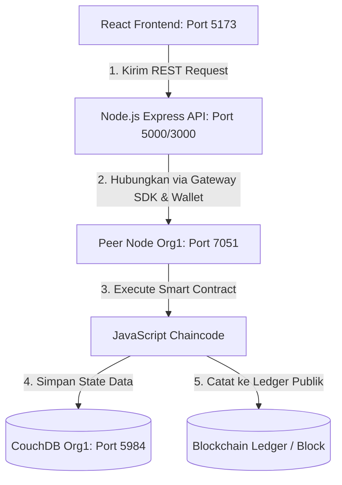

# 🚀 Panduan Demonstrasi dan Simulasi Proyek
> **Sistem Traceability Logistik Ekspor-Impor (Hyperledger Fabric v2.2)**

Dokumen ini menjelaskan langkah-langkah untuk mendemonstrasikan atau mensimulasikan proyek **Traceability Logistik Ekspor-Impor** dari Kelompok 7.

Terdapat **dua metode** yang dapat digunakan untuk demonstrasi:
1. **Metode A: Mode Simulasi Cepat (Rekomendasi)** — Berjalan 100% di browser dalam hitungan detik menggunakan database lokal simulasi. Sangat cocok untuk demo presentasi cepat atau jika komputer Anda memiliki keterbatasan resource.
2. **Metode B: Mode Integrasi Penuh (Blockchain Asli)** — Menghubungkan React Frontend → Node.js Express REST API → Jaringan Blockchain Hyperledger Fabric (Docker) → Chaincode. Cocok untuk pengujian teknis akhir dan uji coba blockchain nyata.

---

## 🎨 Arsitektur Aliran Data

Sebelum memulai, berikut adalah gambaran bagaimana data mengalir di dalam sistem ini:



---

## ⚡ Metode A: Mode Simulasi Cepat (Rekomendasi)

Aplikasi Frontend telah dilengkapi dengan **Mode Simulasi Cepat (Offline Fallback)**. Jika API Backend tidak terdeteksi, frontend secara otomatis mengaktifkan database simulasi di dalam `localStorage` browser Anda.

Semua fungsi bisnis (Pendaftaran Kontainer Baru, Mutasi Logistik / Update Status, Pencarian Histori Audit, dan Pelacakan Garis Waktu) berjalan **100% interaktif** dengan visual yang premium.

### 🏃‍♂️ Langkah Menjalankan:
1. **Buka terminal** di sistem Anda.
2. **Masuk ke direktori frontend**:
   ```bash
   cd PBP-Hyperledger-Traceability-Kelompok7/frontend
   ```
3. **Instal dependensi** (jika belum pernah):
   ```bash
   npm install
   ```
4. **Jalankan web server lokal**:
   ```bash
   npm run dev
   ```
5. **Buka link yang tertera** di terminal Anda (biasanya `http://localhost:5173`).

### 📦 Skenario Demonstrasi / Alur Simulasi (Metode A):

> [!TIP]
> Gunakan skenario langkah-demi-langkah berikut untuk memukau audiens atau dosen saat demonstrasi.

* **Langkah 1: Eksplorasi Dasbor (Overview)**
  * Saat pertama kali dibuka, Anda akan disajikan dasbor logistik yang indah dengan statistik pengiriman aktif, bagan status kontainer (*In Transit*, *Customs Clearance*, *Delivered*), dan daftar kontainer aktif.
  * Terdapat dua data sampel siap pakai: `CONT-2026-001` (Biji Kopi Gayo Arabika Premium) dan `CONT-2026-002` (Kain Katun Organik).
* **Langkah 2: Daftarkan Kontainer Baru**
  * Masuk ke menu **Registrasi Ekspor** di panel navigasi.
  * Isi form pendaftaran, contoh:
    * **ID Kontainer:** `CONT-2026-007`
    * **Nama Barang:** `Udang Vaname Frozen Super`
    * **Eksportir / Pemilik:** `PT Bahari Nusantara`
    * **Negara Tujuan:** `Port of Shanghai, China`
    * **Kuantitas:** `15000 kg`
    * **Harga Barang (Data Privat):** `450000000` (Rp 450 Juta)
  * Klik **Daftarkan Barang ke Blockchain**. Anda akan melihat efek loading transaksi, diikuti notifikasi sukses beserta **Transaction ID (Hash)** yang dihasilkan secara otomatis!
* **Langkah 3: Perbarui Status Logistik (Mutasi Perjalanan)**
  * Masuk ke menu **Update Status**.
  * Masukkan ID Kontainer yang baru Anda buat (`CONT-2026-007`).
  * Perbarui kepemilikan dan lokasi barunya, misalnya:
    * **Pemilik Baru:** `PT Logistik Samudera Express`
    * **Lokasi Baru:** `Pelabuhan Tanjung Perak, Surabaya`
    * **Status Baru:** `In Transit`
  * Klik **Update Status / Pemilik**. Status berhasil di-update dengan mencatatkan Hash Transaksi baru di Ledger.
* **Langkah 4: Lacak Traceability & Audit Trail**
  * Masuk ke menu **Traceability / Pelacakan**.
  * Cari ID Kontainer `CONT-2026-007` (atau gunakan data sampel `CONT-2026-001` yang memiliki riwayat perjalanan panjang).
  * Anda akan disajikan **Peta Garis Waktu Perjalanan (Timeline)** yang interaktif.
  * Tunjukkan ke audiens bahwa data **Harga Barang bersifat privat (Private Data Collection)**. Di dalam riwayat, harga barang ditampilkan sebagai **(Terenskripsi)** untuk menjaga kerahasiaan bisnis antar pihak, namun validitas transaksinya tetap terjamin di blockchain.

---

## 🐳 Metode B: Mode Integrasi Penuh (Blockchain Asli)

Metode ini memerlukan Docker dan resource komputer yang cukup (~8 GB RAM) untuk menjalankan 8 kontainer jaringan Hyperledger Fabric.

### 📋 Prasyarat:
* Docker & Docker Compose terinstal dan sedang berjalan.
* Port `5000` (Backend API), `5173` (Frontend), `7051`/`9051` (Peer Nodes), dan `5984`/`6984` (CouchDB) tidak sedang digunakan oleh aplikasi lain.

---

### 🛠️ Langkah-Langkah Eksekusi Jaringan & Integrasi:

#### 1. Jalankan Jaringan Blockchain (Kelolaan Anggota 1)
Buka terminal baru di root folder `/home/ervan/api-fabric/jp8-pbp` (tempat `docker-compose.yaml` berada):
```bash
# Pastikan path ke binary fabric-samples sudah diexport
export PATH=/home/ervan/fabric-samples/bin:$PATH
export FABRIC_CFG_PATH=/home/ervan/api-fabric/jp8-pbp

# Jalankan Jaringan
docker-compose up -d

# Pastikan semua container running dengan baik
docker ps --format "table {{.Names}}\t{{.Status}}\t{{.Ports}}"
```

#### 2. Konfigurasi Channel & Join Peers (Kelolaan Anggota 1)
Masuk ke CLI Container untuk mendaftarkan peers ke channel:
```bash
# Masuk ke CLI container
docker exec -it cli bash

# Buat Channel 'mychannel'
peer channel create -o orderer.logistik.com:7050 -c mychannel \
  -f ./channel-artifacts/mychannel.tx \
  --tls --cafile /opt/gopath/src/github.com/hyperledger/fabric/peer/crypto/ordererOrganizations/logistik.com/orderers/orderer.logistik.com/msp/tlscacerts/tlsca.logistik.com-cert.pem

# Org1 (Eksportir) Join Channel
peer channel join -b mychannel.block
peer channel update -o orderer.logistik.com:7050 -c mychannel -f ./channel-artifacts/Org1EksportirMSPanchors.tx --tls --cafile /opt/gopath/src/github.com/hyperledger/fabric/peer/crypto/ordererOrganizations/logistik.com/orderers/orderer.logistik.com/msp/tlscacerts/tlsca.logistik.com-cert.pem

# Org2 (Importir) Join Channel
export CORE_PEER_ADDRESS=peer0.org2importir.logistik.com:9051
export CORE_PEER_LOCALMSPID=Org2ImportirMSP
export CORE_PEER_MSPCONFIGPATH=/opt/gopath/src/github.com/hyperledger/fabric/peer/crypto/peerOrganizations/org2importir.logistik.com/users/Admin@org2importir.logistik.com/msp
export CORE_PEER_TLS_CERT_FILE=/opt/gopath/src/github.com/hyperledger/fabric/peer/crypto/peerOrganizations/org2importir.logistik.com/peers/peer0.org2importir.logistik.com/tls/server.crt
export CORE_PEER_TLS_KEY_FILE=/opt/gopath/src/github.com/hyperledger/fabric/peer/crypto/peerOrganizations/org2importir.logistik.com/peers/peer0.org2importir.logistik.com/tls/server.key
export CORE_PEER_TLS_ROOTCERT_FILE=/opt/gopath/src/github.com/hyperledger/fabric/peer/crypto/peerOrganizations/org2importir.logistik.com/peers/peer0.org2importir.logistik.com/tls/ca.crt

peer channel join -b mychannel.block
peer channel update -o orderer.logistik.com:7050 -c mychannel -f ./channel-artifacts/Org2ImportirMSPanchors.tx --tls --cafile /opt/gopath/src/github.com/hyperledger/fabric/peer/crypto/ordererOrganizations/logistik.com/orderers/orderer.logistik.com/msp/tlscacerts/tlsca.logistik.com-cert.pem

# Keluar dari CLI container
exit
```

#### 3. Instalasi & Deploy Chaincode (Kelolaan Anggota 2)
Jalankan lifecycle chaincode untuk menginstal Smart Contract `index.js` (JavaScript Chaincode) ke dalam peer nodes Anda. (Gunakan perintah `peer lifecycle chaincode` standard untuk me-package, menginstall, menyetujui, dan menyebarkan chaincode `traceability` di channel `mychannel`).

#### 4. Jalankan REST API Server (Kelolaan Anggota 3)
Sebelum menyalakan server Express, kita perlu menyinkronkan Wallet Kredensial CA terlebih dahulu.
1. Buka terminal baru dan masuk ke direktori backend:
   ```bash
   cd PBP-Hyperledger-Traceability-Kelompok7/backend
   ```
2. Pastikan file `connection.json` sudah ada di dalam folder `backend/`. Jika belum, salin dari config network utama.
3. Instal dependensi:
   ```bash
   npm install
   ```
4. **Daftarkan Identitas Admin** dari CA:
   ```bash
   npm run enrollAdmin
   ```
5. **Daftarkan User Aplikasi (appUser)**:
   ```bash
   npm run registerUser
   ```
6. **Jalankan Server REST API**:
   ```bash
   npm start
   ```
   *Server backend akan mendengarkan di port `5000` (atau port `3000` sesuai konfigurasi .env).*

#### 5. Jalankan Frontend Client (Kelolaan Anggota 4)
1. Buka terminal baru dan masuk ke direktori frontend:
   ```bash
   cd PBP-Hyperledger-Traceability-Kelompok7/frontend
   ```
2. Jalankan instalasi dependensi & start server:
   ```bash
   npm install
   npm run dev
   ```
3. Buka browser Anda di `http://localhost:5173`.
4. Sistem sekarang telah terhubung sepenuhnya secara live ke jaringan Hyperledger Fabric! Semua perubahan data di UI akan langsung melakukan mining transaksi nyata di node-node Docker dan menyimpan statusnya di CouchDB.

---

## 🧹 Langkah Merapikan & Reset Jaringan
Setelah selesai melakukan simulasi, Anda dapat membersihkan kontainer dan volume Docker agar memori komputer kembali lega:

```bash
cd /home/ervan/api-fabric/jp8-pbp

# Matikan jaringan dan hapus volume database untuk reset bersih
docker-compose down -v
```

> [!NOTE]
> Menghapus volume dengan flag `-v` akan menghapus seluruh database transaksi lama sehingga jaringan akan bersih kembali saat dinyalakan berikutnya.
